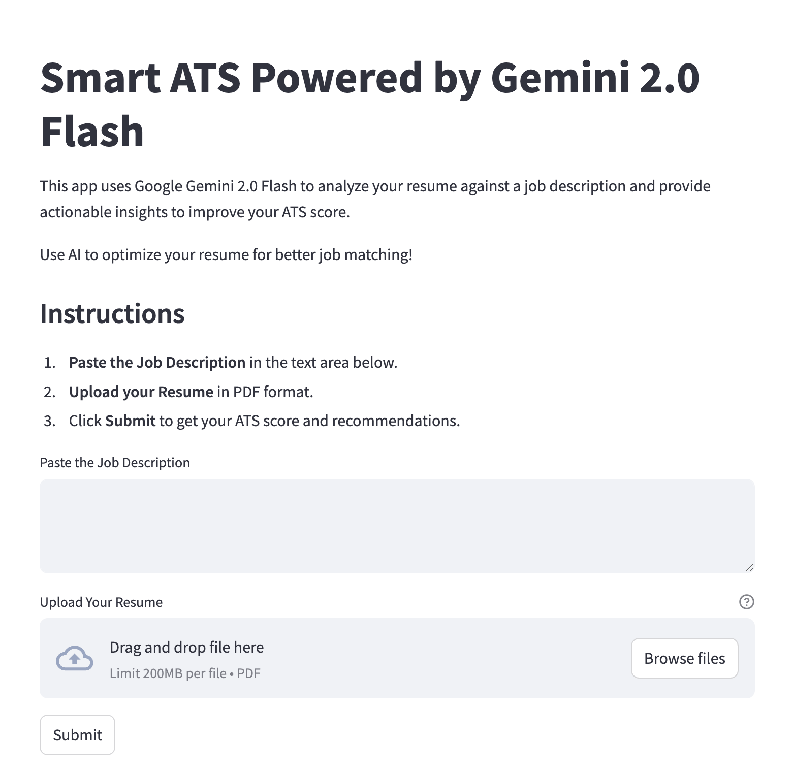
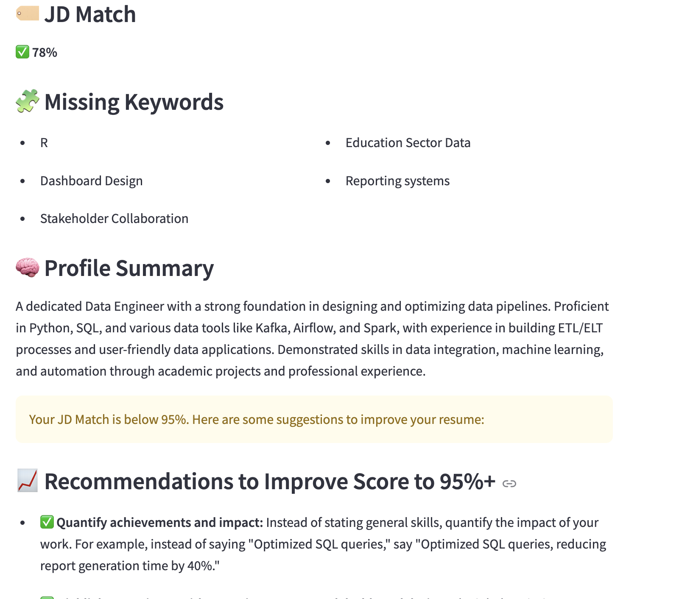

# 🤖 Smart ATS System using LLM (Gemini 2.0 Flash + Streamlit)

A Smart ATS (Applicant Tracking System) built with **Google's Gemini LLM** and **Streamlit** to help job seekers tailor their resumes to specific job descriptions. This tool evaluates resumes against job descriptions, provides a match score, highlights missing keywords, and offers personalized recommendations to improve the match.

## 🚀 Features

- 📄 Upload and analyze your resume (PDF format)
- 📋 Paste any job description
- 🔍 Get an **ATS-style evaluation** using a large language model (Gemini 2.0 Flash)
- ✅ Receive:
  - JD Match percentage
  - Missing keywords
  - Personalized profile summary
  - Tailored suggestions to boost your match score to 95%+

---
## 🖼️ Screenshots

### 📊 Dashboard View


### 📥 LLM Response Output


## 🛠️ Tech Stack

- [Streamlit](https://streamlit.io/) — UI for the web app
- [Google Generative AI (Gemini)](https://ai.google.dev/) — LLM for semantic matching
- [PyPDF2](https://pypi.org/project/PyPDF2/) — PDF parsing
- [dotenv](https://pypi.org/project/python-dotenv/) — Secure API key handling

---

## 🧑‍💻 How It Works

1. User uploads a **PDF resume**
2. User pastes a **job description**
3. The app sends both to Gemini 2.0 via a well-crafted prompt
4. Gemini returns a JSON string with:
   - `JD Match`
   - `MissingKeywords`
   - `Profile Summary`
   - `ImprovementSuggestions`
5. Streamlit parses and displays the results in a clean UI

---

## 📦 Installation

1. **Clone the repo**:
   ```bash
   git clone https://github.com/samuelstrike/Smart-ATS-System-Powered-by-LLM.git
   cd Smart-ATS-System-Powered-by-LLM

2. **Create virtual Env**:
   ```bash
   python -m venv venv
   source venv/bin/activate  # On Windows use `venv\Scripts\activate`

3. **Install Dependencies**
   ```bash
   pip install -r requirements.txt

4. **Set up your environment variables**
    
    - Create a .env file in the root directory
    - Add your Google API key:
    
   ```bash
   GOOGLE_API_KEY=your_google_api_key_here

5. **Running the App**

    ```bash
    streamlit run app.py